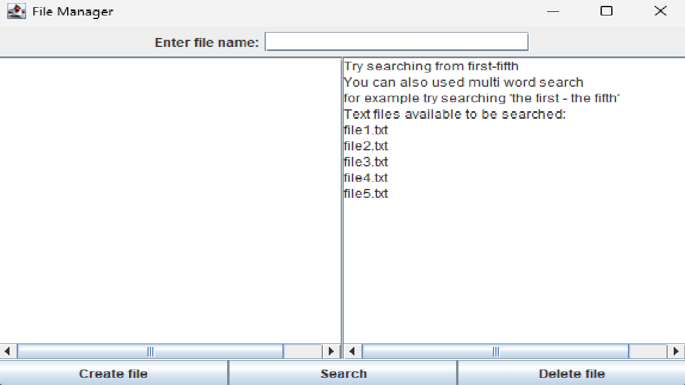

# OOP Assignment
## My Search Engine

### This assigment was to create a program where a user uses a GUI to search through a set of text file contents using Java.
## Classes and functions:
* MyGUI: This is the main class that implements the GUI for a file manager application. This class extents Jframe and implements the ActionListener interface.
* updateFileListArea: This fuction updates a text area in the GUI with a list of available ".txt" files in the directory.
* ActionPerformed: These are part of the MyGUI class which do different thing such as track when buttons such as "delete" and "create" are pressed and it returns a funtion.
## Core Functionaluty:
* This code is for a GUI-based file manager application in java.
* It creates a window with a text box, three buttons, and two text areas.
* The first text area displays the search results, and the second text area displays a list of all available text files that can be searched.
* The buttons are used to create a new file, search for a word in the available files, and delete a file.
* The search functionality of this program works by allowing users to input a word to search for and then goes through each file in the current directory that has the .txt extension.
## Optional Functionality:
* For this I made it so the user chas the options between searching using one word or two words/phrases.
* Other option functionality would be the ability to create files themselves.
* Also they have the ability to delete files too.
## If I had more time:
* Multi-select and batch operations: Allow users to select multiple files and perform batch operations such as copy, move, delete, or rename.
* Sorting options: Allow users to sort files by date, name, size, or other properties.
* File preview: Implement a file preview feature that allows users to preview the contents of a file without opening it.
* Bookmarking: Allow users to bookmark frequently accessed folders or files for quick access.
